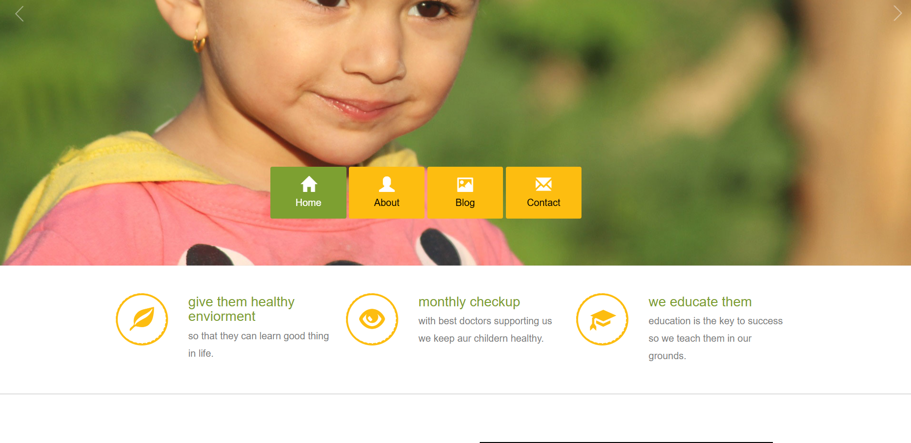
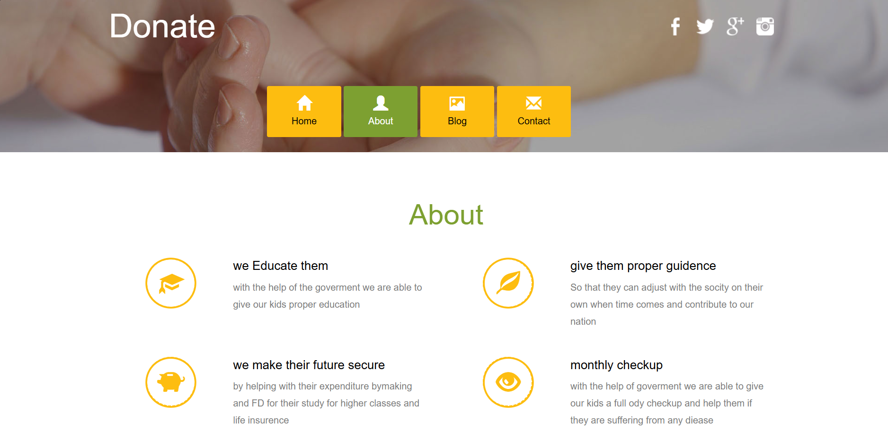
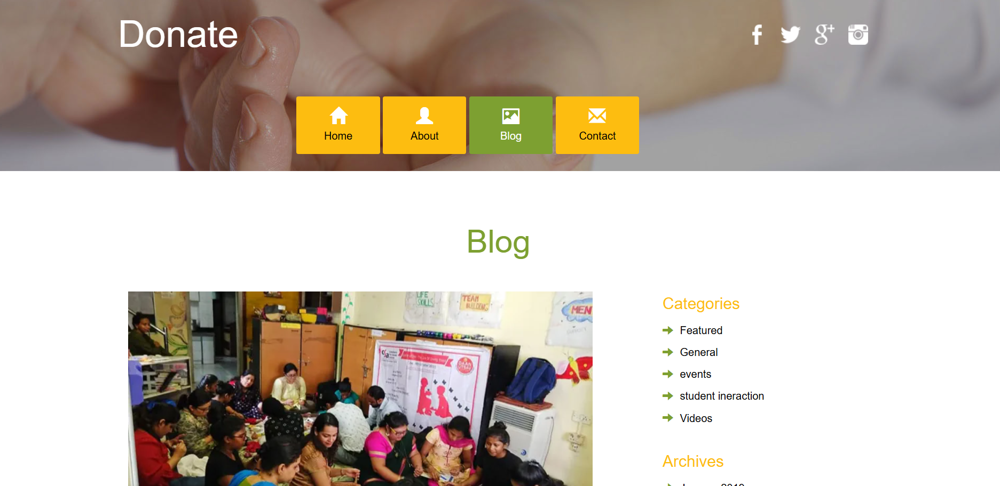
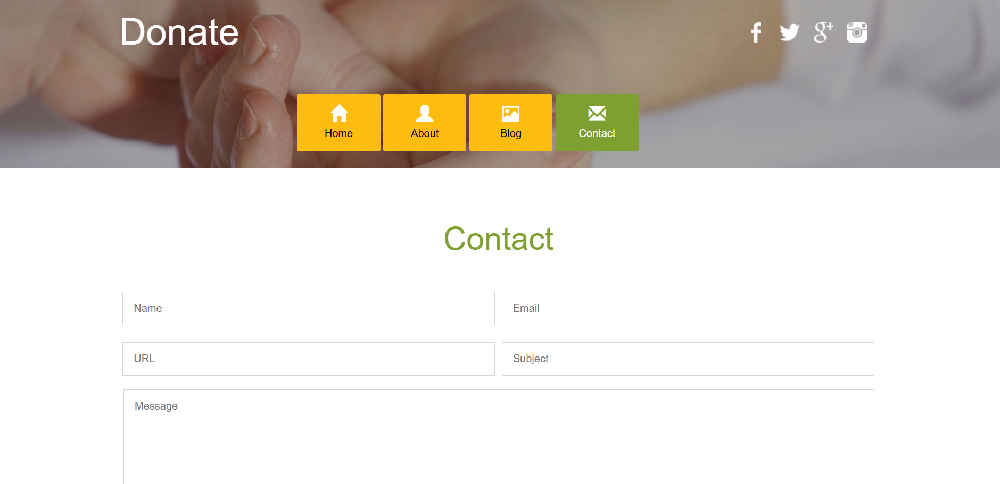

made an dummy NGO website using HTML, CSS, and Javascript to provide a clean and responsive platform for showcasing the organization's mission and activities. The site features an engaging design, easy navigation, and interactive elements to help connect with visitors and encourage community participation

this website consist of different pages which help to showcase about the ngo and its daily events and and a blog page to show the activites happen in ngo with the childrens

images of the website :
home page:where the basic information of the ngo is showen.

about page: deatils of the ngo and it's founder

blog page: all the event and activites are shocased here .

contac page : to contact and help the ngo in any way you can reach to them through this 

to make this project i have used the
##HTML,CSS AND JAVASCRIPT AND MADE IT USING VSCODE##
